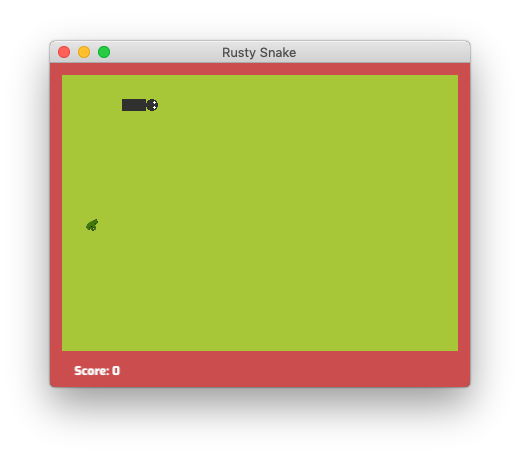

# Rusty Snake Game

The classic snake game built with ***[Rust](https://www.rust-lang.org/) programming language*** using [*Piston*](https://www.piston.rs/) game engine.

## Screenshots



## How to run

To build the game, you need to have *Rust 1.31* or higher installed in your machine with the MSVC Build Tools or MinGW for windows, GCC for linux or Xcode Tools for macOS.

### Prerequisites

- Rustc
- Cargo

### To run the debug binary

  ```bash
  cargo run
  ```

### To build the release binary

  ```bash
  cargo build --release
  ```

## License

Rusty Snake is distributed under the terms of both the MIT license and the Apache License (Version 2.0). See [LICENSE-APACHE](LICENSE-APACHE) and [LICENSE-MIT](LICENSE-MIT) for details. Opening a pull requests is assumed to signal agreement with these licensing terms.